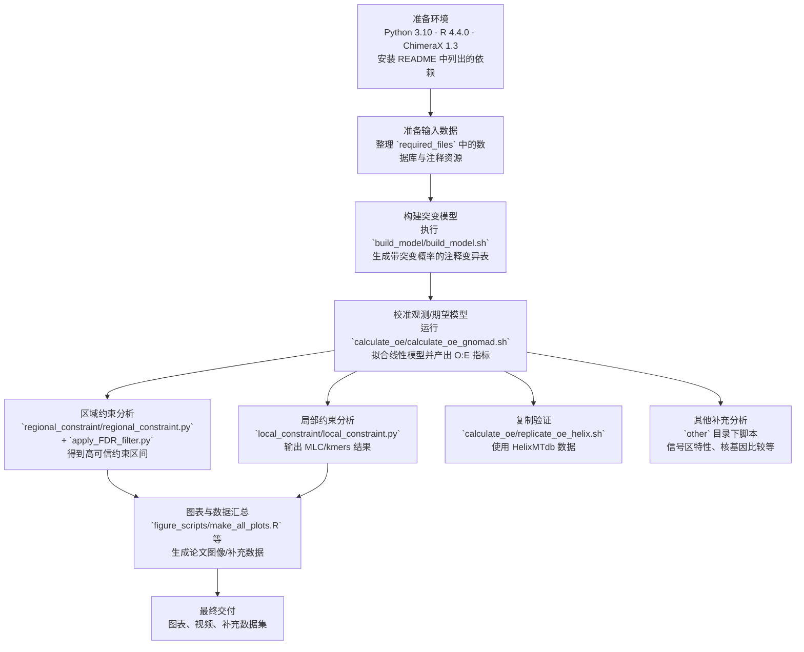

# 线粒体基因组约束研究代码

本仓库提供用于量化人类线粒体基因组约束的脚本，并生成[我们论文](https://www.biorxiv.org/content/10.1101/2022.12.16.520778v2)中展示的数据和图像。我们通过识别在 gnomAD 中观测到的 mtDNA 变异低于中性假设下预期值的基因和区域，来评估基因组约束。

注意：预先计算的线粒体约束指标已在论文的补充数据集中提供。

## 概览：

下方展示了所使用的工作流程。每个目录的 README 文件中提供了更多内容信息。

`required_files`：代码所需的输入文件。

`build_model`：用于建立线粒体突变模型的代码，以及用于量化可突变性的 de novo 突变数据整理。

`calculate_oe`：用于评估线粒体功能变异类别和位点约束的代码。

`regional_constraint`：用于识别区域性约束的代码。

`local_constraint`：用于识别局部约束并生成线粒体局部约束（MLC）评分的代码。

`other`：论文中展示的其他分析代码。

`figure_scripts`：用于生成图像、视频和数据集的脚本。


## 细节：

代码在 MacOS 或 Linux 系统上使用 Python v3.10、R v3.6.1/v4.4.0 和 ChimeraX v1.3 运行。

可以通过下载 ZIP 文件或使用 Git 克隆方式将本仓库复制到本地计算机。

成功运行 R 脚本所使用的 Python 库版本：

```
Python version 3.10

biopython 1.84  numpy 1.26.4    pandas 2.2.1    scipy 1.14  svglib 1.5.1
```

成功运行 R 脚本所使用的 R 包版本：

```
R version 4.4.0 (2024-04-24)

attached base packages:
[1] parallel  stats     graphics  grDevices utils     datasets  methods   base     

other attached packages:
 [1] openxlsx_4.2.5.2  R.utils_2.12.3    R.oo_1.26.0       R.methodsS3_1.8.2 circlize_0.4.16   ggExtra_0.10.1   
 [7] colorspace_2.1-0  scales_1.3.0      ggrepel_0.9.5     lubridate_1.9.3   purrr_1.0.2       tibble_3.2.1     
[13] tidyverse_2.0.0   ggsignif_0.6.4    readr_2.1.5       png_0.1-8         spgs_1.0-4        forcats_1.0.0    
[19] ggpubr_0.6.0      data.table_1.15.4 ggplot2_3.5.1     stringr_1.5.1     cocor_1.1-4       tidyr_1.3.1      
[25] dplyr_1.1.4       doParallel_1.0.17 iterators_1.0.14  foreach_1.5.2    

loaded via a namespace (and not attached):
 [1] tidyselect_1.2.1    farver_2.1.2        fastmap_1.2.0       promises_1.3.0      digest_0.6.36      
 [6] timechange_0.3.0    mime_0.12           lifecycle_1.0.4     magrittr_2.0.3      compiler_4.4.0     
[11] rlang_1.1.4         tools_4.4.0         utf8_1.2.4          labeling_0.4.3      bit_4.0.5          
[16] RColorBrewer_1.1-3  abind_1.4-5         miniUI_0.1.1.1      withr_3.0.0         grid_4.4.0         
[21] fansi_1.0.6         xtable_1.8-4        cli_3.6.3           crayon_1.5.3        ragg_1.3.2         
[26] generics_0.1.3      rstudioapi_0.16.0   tzdb_0.4.0          splines_4.4.0       vctrs_0.6.5        
[31] Matrix_1.7-0        carData_3.0-5       car_3.1-2           hms_1.1.3           bit64_4.0.5        
[36] rstatix_0.7.2       systemfonts_1.1.0   glue_1.7.0          codetools_0.2-20    cowplot_1.1.3      
[41] stringi_1.8.4       gtable_0.3.5        shape_1.4.6.1       later_1.3.2         munsell_0.5.1      
[46] pillar_1.9.0        htmltools_0.5.8.1   R6_2.5.1            textshaping_0.4.0   vroom_1.6.5        
[51] shiny_1.8.1.1       lattice_0.22-6      backports_1.5.0     broom_1.0.6         httpuv_1.6.15      
[56] zip_2.3.1           Rcpp_1.0.12         nlme_3.1-165        mgcv_1.9-1          pkgconfig_2.0.3    
[61] GlobalOptions_0.1.2
```

## 参考文献

[1] Nicole J. Lake, Wei Liu, Stephanie L. Battle, Kristen M. Laricchia, Grace Tiao, Daniela Puiu, Alison G. Compton, Shannon Cowie, John Christodoulou, David R. Thorburn, Hongyu Zhao, Dan E. Arking, Shamil R. Sunyaev, Monkol Lek. 人类线粒体基因组约束的定量分析. bioRxiv 2023; doi: https://doi.org/10.1101/2022.12.16.520778

# Code for mitochondrial genome constraint manuscript

This repository provides the scripts used to quantify constraint across the human mitochondrial genome, and to generate the data and figures presented in [our manuscript.](<https://www.biorxiv.org/content/10.1101/2022.12.16.520778v2>) We assessed constraint by identifying genes and regions where the observed mtDNA variation in gnomAD is less than expected, under neutrality.

Note that pre-computed mitochondrial constraint metrics are available in the Supplementary Dataset of the manuscript. 

## Overview:

The workflow used is reflected below. See the README in each directory for more information on contents.

`required_files`: input files for code.

`build_model`: code used to build the mitochondrial mutational model, and to curate of de novo mutations used to quantify mutability.

`calculate_oe`: code for assessment of mitochondrial constraint across functional variant classes and loci. 

`regional_constraint`: code used to identify regional constraint.

`local_constraint`: code used to identify local constraint and generate the mitochondrial local constraint (MLC) score.

`other`: code for other analyses presented in the manuscript.

`figure_scripts`: scripts used for generating figures, video and datasets.

## Details:

The code was run using Python v3.10, R v3.6.1/v4.4.0, and ChimeraX v1.3 on a MacOS and or Linux system.

A copy of this repository can be obtained on a local computer by downloading as a zip file or cloning using Git.

Python library versions successfully used to run the R scripts.

```
Python version 3.10

biopython 1.84  numpy 1.26.4    pandas 2.2.1    scipy 1.14  svglib 1.5.1
```

R package versions successfully used to run the R scripts.

```
R version 4.4.0 (2024-04-24)

attached base packages:
[1] parallel  stats     graphics  grDevices utils     datasets  methods   base     

other attached packages:
 [1] openxlsx_4.2.5.2  R.utils_2.12.3    R.oo_1.26.0       R.methodsS3_1.8.2 circlize_0.4.16   ggExtra_0.10.1   
 [7] colorspace_2.1-0  scales_1.3.0      ggrepel_0.9.5     lubridate_1.9.3   purrr_1.0.2       tibble_3.2.1     
[13] tidyverse_2.0.0   ggsignif_0.6.4    readr_2.1.5       png_0.1-8         spgs_1.0-4        forcats_1.0.0    
[19] ggpubr_0.6.0      data.table_1.15.4 ggplot2_3.5.1     stringr_1.5.1     cocor_1.1-4       tidyr_1.3.1      
[25] dplyr_1.1.4       doParallel_1.0.17 iterators_1.0.14  foreach_1.5.2    

loaded via a namespace (and not attached):
 [1] tidyselect_1.2.1    farver_2.1.2        fastmap_1.2.0       promises_1.3.0      digest_0.6.36      
 [6] timechange_0.3.0    mime_0.12           lifecycle_1.0.4     magrittr_2.0.3      compiler_4.4.0     
[11] rlang_1.1.4         tools_4.4.0         utf8_1.2.4          labeling_0.4.3      bit_4.0.5          
[16] RColorBrewer_1.1-3  abind_1.4-5         miniUI_0.1.1.1      withr_3.0.0         grid_4.4.0         
[21] fansi_1.0.6         xtable_1.8-4        cli_3.6.3           crayon_1.5.3        ragg_1.3.2         
[26] generics_0.1.3      rstudioapi_0.16.0   tzdb_0.4.0          splines_4.4.0       vctrs_0.6.5        
[31] Matrix_1.7-0        carData_3.0-5       car_3.1-2           hms_1.1.3           bit64_4.0.5        
[36] rstatix_0.7.2       systemfonts_1.1.0   glue_1.7.0          codetools_0.2-20    cowplot_1.1.3      
[41] stringi_1.8.4       gtable_0.3.5        shape_1.4.6.1       later_1.3.2         munsell_0.5.1      
[46] pillar_1.9.0        htmltools_0.5.8.1   R6_2.5.1            textshaping_0.4.0   vroom_1.6.5        
[51] shiny_1.8.1.1       lattice_0.22-6      backports_1.5.0     broom_1.0.6         httpuv_1.6.15      
[56] zip_2.3.1           Rcpp_1.0.12         nlme_3.1-165        mgcv_1.9-1          pkgconfig_2.0.3    
[61] GlobalOptions_0.1.2
```


## Reference

[1] Nicole J. Lake, Wei Liu, Stephanie L. Battle, Kristen M. Laricchia, Grace Tiao, Daniela Puiu, Alison G. Compton, Shannon Cowie, John Christodoulou, David R. Thorburn, Hongyu Zhao, Dan E. Arking, Shamil R. Sunyaev, Monkol Lek. Quantifying constraint in the human mitochondrial genome. bioRxiv 2023; doi: https://doi.org/10.1101/2022.12.16.520778